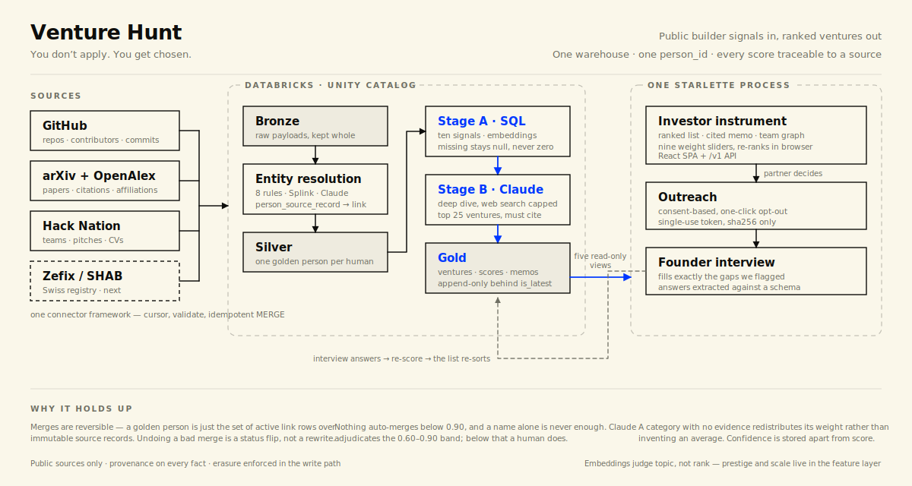

<p align="center">
  
</p>

Early-signal deal sourcing for a VC fund: scrape public builder signals (GitHub,
papers, Swiss registry, Hack Nation), resolve them to golden person records,
group people and artifacts into ventures, score against the fund's thesis, and
surface ranked candidates with cited memos and consent-based AI interviews.

The full design and build plan live in [docs/plan/](docs/plan/) — start with
[handover.md](docs/plan/handover.md). Conventions are in [AGENTS.md](AGENTS.md)
and [docs/styleguide/](docs/styleguide/).



## How it works

Four connectors sweep public sources on a cursor and write whatever they find
into Bronze untouched. Nothing is interpreted on the way in: a re-scrape that
finds no change writes nothing, and a profile that fails validation lands in a
rejects table instead of stopping the run.

The hard part is deciding who is who. The same builder shows up as a GitHub
login, a paper author and a hackathon profile, and those identities stay
separate until there is evidence to link them. Eight deterministic rules go
first, Splink scores the remainder, Claude adjudicates the uncertain middle
band, and anything below that waits for a human. A golden person is never a
rewrite — it is just the set of active link rows laid over immutable source
records, so undoing a bad merge is a status flip.

Scoring runs in two passes. Stage A computes ten signals in SQL and turns them
into nine weighted categories; a signal we could not find stays null rather than
becoming zero, because unknown and bad are not the same claim. Stage B sends the
shortlist to Claude with web search for the judgements that don't reduce to a
query — whether a product is genuinely defensible, whether the market is real —
under a hard search cap, quoting its sources.

What comes out is a ranked list the partner can re-sort in the browser by
dragging weights, each venture carrying a cited memo and an explicit list of
what we could not find. Those gaps are the interview: the founder gets a
consent-based invitation, answers only what they want to, and their answers flow
back as a fresh score. The founder never applies — that is the whole point, and
it is why the word *chosen* appears in the product's vocabulary rather than in
its name.

Every fact carries provenance, the app reads five views and never a base table,
and erasure is enforced in the write path rather than bolted on.

## Setup

```sh
uv sync                       # Python 3.13, all dependency groups
uv run pre-commit install     # the gate runs on every commit
uv run poe test
```

Warehouse-backed commands (`poe ddl-apply`, `poe fixtures-load`, `poe smoke`)
need Databricks credentials in `.env` — see
[docs/runbooks/databricks.md](docs/runbooks/databricks.md).

## Deploy

One container serves everything: the Starlette app mounts the built React
bundle at `/` and answers `/v1` on the same origin, so there is no CORS layer
and no second deployment to keep in sync. It must run as a **single long-lived
process** — sessions live in memory (`app/auth.py`), so a serverless host or a
second instance would sign users out. `fly.toml` pins one always-on machine;
do not `fly scale count` above 1.

```sh
docker build -t venture-hunt .
docker run -p 8080:8080 --env-file .env venture-hunt   # verify locally first

fly launch --no-deploy        # accepts the committed fly.toml
fly secrets set \
  DATABRICKS_HOST=... DATABRICKS_CLIENT_ID=... \
  DATABRICKS_CLIENT_SECRET=... DATABRICKS_WAREHOUSE_ID=... \
  DATABRICKS_LLM_ENDPOINT=databricks-claude-opus-4-8 \
  APP_PASSWORD='<the password you hand out>'
fly deploy
```

Omitting `--fixtures` selects the live Databricks path, which makes all four
`DATABRICKS_*` keys and `APP_PASSWORD` mandatory — the app fails fast at boot
without them. Reviewers sign in with `APP_PASSWORD` alone; the email field on
the login page is prefilled decoration.

Note that Databricks Free Edition enforces a **daily compute quota**. Once it
is spent, every warehouse-backed route returns 500 until the next day, so plan
demos around it.

## Implementation & technology

### Data sources

Every connector runs on the same small framework. It reads a cursor, fetches,
validates into typed models, writes with an idempotent MERGE, and advances the
cursor only after the write succeeds. Records that fail validation land in a
rejects table rather than stopping the run, so one malformed profile never
costs us a sweep.

- **GitHub** — recently created repositories, bisected by creation date to get
  past the search API's thousand-result ceiling, then commit history and
  contributor profiles hydrated in batched GraphQL calls.
- **arXiv + OpenAlex** — arXiv is the spine; OpenAlex adds citations, ORCIDs
  and institutions through DOI-batch lookups. Semantic Scholar is optional and
  its absence is a no-op.
- **Hack Nation** — our own connector against the two public JSON endpoints
  behind the showcase: participants, projects, teams, pitches and CVs.
- **Zefix / SHAB** — the Swiss company registry. Schema and fixtures are in
  place; the connector is next.

### What we store

Three Delta layers in Unity Catalog, each with a distinct job.

- **Bronze** keeps each source payload intact in a `VARIANT` column, one row
  per object under the source's own ID, alongside a content hash and an ETag.
  A re-scrape that finds no change writes nothing. Change Data Feed is on, so
  silver rebuilds process only what moved.
- **Silver** is the conformed model: `person`, `project`, `publication` and
  `company`, joined to people through `contribution`, `authorship` and
  `officer`, with `person_connection` holding the collaboration graph as an
  edge table rather than an array.
- **Gold** serves the product: `venture` and its members, `person_features`,
  `venture_score` and `memo`. Scores are append-only behind an `is_latest`
  flag, so every re-score keeps its history, and each carries a `breakdown`
  holding the evidence URL behind every claim.

`person_features` stores its numbers in a `MAP<STRING,DOUBLE>` rather than
columns, so adding a signal needs no migration. The application never queries a
base table; it reads five `gold.v_*` views and nothing else.

### Deduplicating people

The same builder may appear as a GitHub login, a paper author and a hackathon
profile. We keep those source identities separate until there is enough
evidence to link them.

Each becomes an immutable `person_source_record`, its ID a UUIDv5 of the source
and source key, so another scrape regenerates exactly the same row. A golden
`person_id` is nothing more than the set of active `person_source_link` rows
laid over those records. Matching runs as a ladder:

- Eight deterministic rules first: ORCID, email, website, handle, a repo-paper
  cross-link, LinkedIn URL, and a Hack Nation project's repository.
- Splink scores whatever the rules left unresolved.
- Claude, called from SQL, adjudicates the 0.60–0.90 band.
- Anything below that goes to a human review queue.

Nothing auto-merges below 0.90, and a name alone is never enough. The payoff is
reversibility: `contribution`, `authorship` and `officer` key on the source
record, and their `person_id` is only a cache, so undoing a bad merge is a
status flip on a link row. No underlying fact is rewritten.

### Embeddings

We embed `profile_text`, a deterministic rendering of what someone builds or
researches, rather than the whole profile. Because the rendering is
deterministic, unchanged inputs produce the same vector.

The model is `databricks-gte-large-en` at 1024 dimensions. Vectors are
L2-normalised, so similarity is a plain dot product we compute in SQL. There is
no vector database and no index. The editable ideal candidate uses the same
representation, which puts both vectors in one space.

They have one job: domain fit — does this person work on that kind of problem.

### Scoring

Each person carries ten signals computed in SQL: weighted stars, commit volume
and consistency, recency on a 90-day half-life, graph centrality, citations,
school tier. A signal we could not find stays null. It never becomes zero,
because unknown and bad are not the same claim.

Claude handles the judgements that do not reduce to a query, such as whether a
commit history shows good work or whether a product is genuinely defensible.
For shortlisted ventures, a deeper pass researches the market on the open web
under a hard search cap, and has to quote its sources.

Nine weighted categories then produce one number. A category with no evidence
redistributes its weight across the rest instead of scoring an invented
average. Team scoring combines the average member with the best one. Confidence
is stored separately from score, so thin evidence stays visible. The weights
belong to the fund, and changing one re-sorts the list in the browser.

The pitch script lives in [presentation/](presentation/), which renders the
diagram above to a slide PDF — one source, so the deck and the README cannot
drift apart.

## License

MIT — see [LICENSE](LICENSE). Use it however you like.
