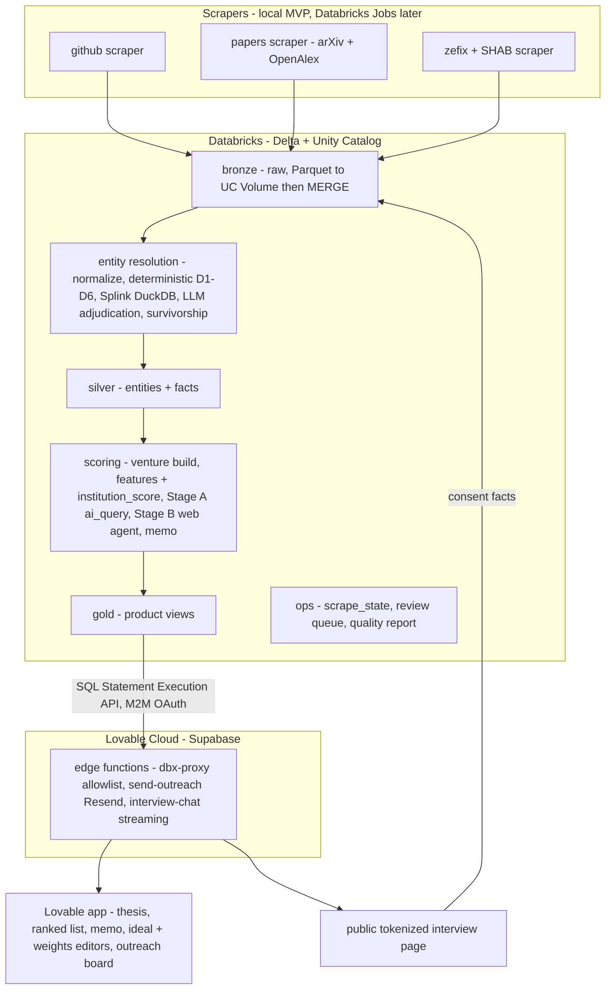

# VC Early-Signal Deal-Sourcing Platform — Plan

A tool for a VC fund to discover **pre-VC teams** (often pre-incorporation) from public signals, link every signal to a golden person record with confidence-scored entity resolution, score teams+ventures against the fund's thesis and an editable "ideal candidate", rank them in a UI, generate investment memos, and run consent-based AI interviews with finalists that fill data gaps and trigger rescoring.

This directory is the **living plan**, split so we can build it iteratively and track progress with checklists. It is not final — we keep refining it.

---

## Scope — Hackathon MVP

An end-to-end working demo in days: three scrapers → Databricks → entity resolution → scoring → Lovable UI (ranking + memo + outreach + AI interview → rescore), with production paths documented but not built. Designed so 4–6 people (each driving their own session) build in parallel off shared contracts.

## Confirmed decisions

1. **Career-history data**: store LinkedIn/portfolio **URLs** (public-sourced) + a web-search enrichment agent + provider free tiers + personal-site enrichment + consent intake in the interview; an **optional LinkedIn self-scraper is isolated behind the `EnrichmentProvider` interface** (ToS-flagged, rip-out-able). No mass LinkedIn scraping in the core pipeline.
2. **Age/gender**: stored per the original spec but **excluded from all scoring**; photo-based inference is behind an **off-by-default flag pending legal sign-off**.
3. **Final score**: **hybrid over a shared calibrated feature layer** — 8 evidence-cited rubric categories + an ordinal-aware **structured** ideal-candidate match (embeddings do domain-fit only; ordinal prestige like MIT>KTH lives in `institution_score`), all under VC-editable weights.
4. **Platform**: Databricks **Free Edition** (non-commercial, hackathon; migrate to a commercial workspace before commercial use). Strict pre-commit gate (see [engineering-standards](reference/engineering-standards.md)).

## Architecture

## First principle: quality over quantity

We optimize for **correct, corroborated, traceable** records and a **reproducible** process, not volume. Enforced by: confidence-scored reversible entity resolution (no name-only merges, 0.90 auto-merge floor); provenance on every fact; a two-stage scoring funnel; selective ingest; data minimization; and five explicit quality gates (venture-likeness gate, ≥2-source corroboration, conflict flagging, a quality gate into the scored pool, and a per-cycle quality report). Full detail in each reference doc; see [scoring-and-memo](reference/scoring-and-memo.md) and [entity-resolution](reference/entity-resolution.md).

---

## Document index

**Overview**
- [README.md](README.md) — this file: scope, decisions, architecture, index
- [roadmap.md](roadmap.md) — stages, milestones, Day-0 checklist, verification (checkboxes)

**Reference specs (the "what/how it's designed")**
- [reference/data-model.md](reference/data-model.md) — full Unity Catalog DDLs (bronze/silver/gold/ops), ID strategy, join paths, views
- [reference/entity-resolution.md](reference/entity-resolution.md) — normalize → deterministic → Splink → LLM adjudication → survivorship; guardrails; unmerge
- [reference/scoring-and-memo.md](reference/scoring-and-memo.md) — venture construction, person_features, the 8+1 category scorers, `institution_score` + seed tiers, funding backbone, funnel + cost, confidence, memo
- [reference/scrapers.md](reference/scrapers.md) — GitHub / papers / Zefix specs, shared runner framework, rate-limit math
- [reference/frontend-outreach.md](reference/frontend-outreach.md) — Lovable pages, the proxy API contract, outreach state machine, AI interview
- [reference/interfaces.md](reference/interfaces.md) — the code interfaces (ABCs) + data contracts that decouple the workstreams
- [reference/engineering-standards.md](reference/engineering-standards.md) — `uv`/`poe`, pre-commit gate, type-checking, docstrings, comments, diagrams, licensing
- [reference/compliance.md](reference/compliance.md) — FADP/GDPR guardrails C1–C6, data & dependency licensing

**Workstreams (the build checklists — one owner each, all parallel after WS0)**
- [workstreams/ws0-platform-and-contracts.md](workstreams/ws0-platform-and-contracts.md) — **blocks everyone; do first**
- [workstreams/ws-a-github-scraper.md](workstreams/ws-a-github-scraper.md)
- [workstreams/ws-b-papers-scraper.md](workstreams/ws-b-papers-scraper.md)
- [workstreams/ws-c-zefix-scraper.md](workstreams/ws-c-zefix-scraper.md)
- [workstreams/ws-d-entity-resolution.md](workstreams/ws-d-entity-resolution.md)
- [workstreams/ws-e-scoring-and-memo.md](workstreams/ws-e-scoring-and-memo.md)
- [workstreams/ws-f-frontend-and-outreach.md](workstreams/ws-f-frontend-and-outreach.md)

## How to use these docs

- **Contract-first**: WS0 freezes the data contract + interfaces + fixtures on Day 1. After the freeze, schema changes are **additive-only**. Every other workstream builds against `dealflow_dev` fixtures without waiting for live scrapers.
- **Checklists**: each workstream file is a `- [ ]` checklist with acceptance criteria. Check items off as we go; the docs are the source of truth for "what's done".
- **Iterative**: this is a living plan. Refine specs in the reference docs; keep the workstream checklists in sync.

## Top risks (summary)

False merges → wrong outreach; Zefix credential latency; Free Edition limits/model availability; email deliverability/compliance; contract churn across parallel sessions; cold-start latency in the live demo; thin web evidence for Swiss teams; ranking-data licensing; noise ventures / data-quality erosion; dependency-license contamination. Mitigations live in each reference doc and are summarized in [roadmap.md](roadmap.md).
